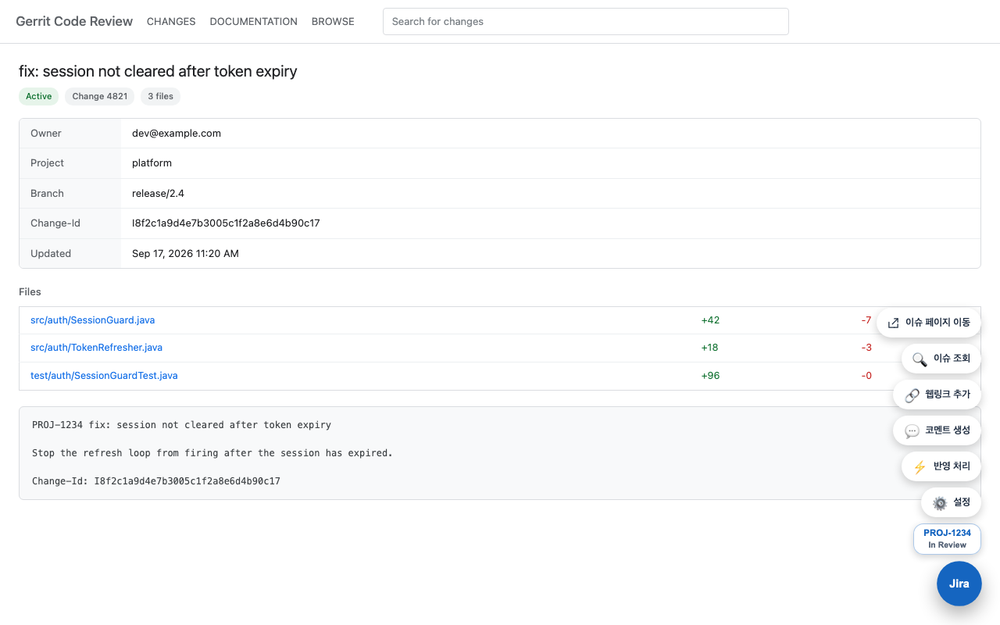
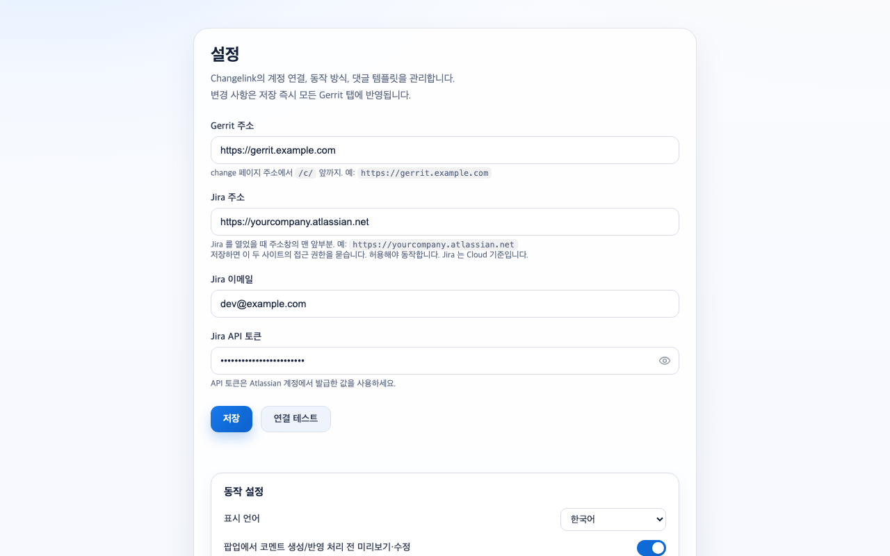

<div align="center">
  
  <h1>Changelink</h1>
  <p><strong>보고 있던 Gerrit change 에서 그대로 Jira 를 갱신한다.</strong></p>
  <p>
    
    
    
    
  </p>
  <p><a href="README.md">English</a> · <strong>한국어</strong></p>
</div>

<p align="center">
  
</p>

change 하나 리뷰 끝내고 Jira 로 넘어가서 링크 붙이고 코멘트 쓰고 상태 옮기면 탭 세 개에
5분이 날아간다. Changelink 는 그걸 change 페이지에서 끝낸다.

커밋 메시지에서 이슈키를 읽어 Jira REST API 를 확장에서 직접 호출한다. 중간에 서버가
없고, 따로 가입할 계정도 없다.

## 뭘 하는가

- change 제목이나 커밋 메시지에서 Jira 이슈키를 찾아, 이슈 상태를 페이지에 바로 표시
- Gerrit change 를 Jira 웹링크(remote link)로 등록
- 직접 만든 템플릿으로 코멘트 작성. 올리기 전에 미리보고 고칠 수 있음
- 이슈 상태 전환
- 위 셋을 한 번에 처리. 같은 코멘트가 이미 있으면 건너뜀
- change 페이지에 끌어서 옮길 수 있는 빠른 실행 버튼. 버튼 구성은 설정에서 고름

## 설치

**Chrome 웹스토어:** [Changelink for Gerrit and Jira Cloud](https://chromewebstore.google.com/detail/jebbalmncnfhgcfgpkomacgmelhbfdcl) (심사 중. 통과하면 이 링크가 열림)

**소스에서:**

```bash
git clone https://github.com/osntak/changelink-gerrit-jira.git
cd changelink-gerrit-jira
npm run build          # changelink-v<버전>.zip 생성
```

`chrome://extensions` 에서 개발자 모드를 켜고 압축 해제된 확장으로 로드한다.

## 설정

확장 아이콘을 누르고 톱니 버튼으로 설정 페이지를 열어 네 칸을 채운다.

| 항목 | 예시 |
| --- | --- |
| Gerrit 주소 | `https://gerrit.example.com` |
| Jira 주소 | `https://yourcompany.atlassian.net` |
| Jira 이메일 | `dev@example.com` |
| Jira API 토큰 | [여기서 발급](https://id.atlassian.com/manage-profile/security/api-tokens) |

저장하면 두 사이트의 접근 권한을 묻는다. 방금 입력한 주소에 대한 호스트 권한을 요청하는
것이고, 허용해야 동작한다. 연결 테스트는 `/rest/api/3/myself` 로 자격증명을 확인하고 HTTP
상태를 그대로 보여준다. 토큰이 틀리면 나중에 조용히 실패하는 대신 401 이라고 말한다.

<p align="center">
  
</p>

## 언어

한국어와 영어를 지원한다. 설정 페이지의 언어 항목에서 브라우저 언어 따라가기, English,
한국어 중에 고른다. 바꾸면 바로 적용되고, 이미 열려 있던 Gerrit 탭도 따라온다.

## 코멘트 템플릿

설정 페이지에서 직접 고친다. 쓸 수 있는 플레이스홀더:

| 플레이스홀더 | 값 |
| --- | --- |
| `{title}` | change 제목 |
| `{body}` | 커밋 메시지 본문 |
| `{branch}` | 대상 브랜치 |
| `{change_num}` | change 번호 |
| `{change_id}` | Change-Id |
| `{project}` | Gerrit 프로젝트 |
| `{owner}` | change 소유자 |
| `{date}` | submit 시각. submit 전이면 빈칸 |
| `{url}` | change 주소 |

`{body}` 에서는 Jira 에 들어가면 지저분해지는 줄을 뺀다. `jira:`, `Change-Id:`,
`cherry-picked from` 세 가지다.

## 권한

| 권한 | 이유 |
| --- | --- |
| `storage` | 주소, 자격증명, 템플릿을 `chrome.storage.local` 에 보관 |
| `scripting` | 설정한 Gerrit 호스트에 content script 를 등록하고, 확장 리로드 후 열려 있던 탭에 다시 주입 |
| 선택적 호스트 권한 | 설정에 입력한 Gerrit/Jira 주소. 저장할 때 요청 |

manifest 에는 호스트가 하나도 박혀 있지 않다. 이 확장이 건드릴 수 있는 사이트는 설정
페이지에 입력한 두 개뿐이고, 그 밖은 닿지 않는다.

자격증명은 `chrome.storage.local` 에만 있고 `sync` 는 쓰지 않는다. 브라우저 밖으로는 본인의
Jira 로 가는 요청의 `Authorization` 헤더 외에 나가지 않으며, 토큰은 어디에도 로그로 남기지
않는다. [PRIVACY.ko.md](PRIVACY.ko.md) 참고.

## 요구사항

- **Jira Cloud.** REST API v3 와 ADF 코멘트 형식을 쓴다. Jira Server / Data Center 는 아직
  동작하지 않는다.
- **Gerrit.** change 주소가 `/c/<project>/+/<번호>` 형태인 표준 구성.

## 구조

| 파일 | 역할 |
| --- | --- |
| `service_worker.js` | 모든 Jira API 호출. 네트워크 요청은 여기서만 |
| `content_script.js` | Gerrit DOM 에서 change 컨텍스트 추출, 빠른 실행 버튼과 상태 배지 렌더 |
| `popup.js` | 툴바 팝업 |
| `options.js` | 설정, 연결 테스트, 호스트 권한 요청 |
| `i18n.js` | 네 곳이 공유하는 문자열 표와 언어 결정 |

## 릴리즈

`vX.Y.Z` 태그를 푸시하면 워크플로가 manifest 버전을 맞추고 zip 을 만들어 GitHub 릴리즈로
올린다.

```bash
git tag v1.5.2 && git push origin v1.5.2
```

## 라이선스

MIT. [LICENSE](LICENSE) 참고.
