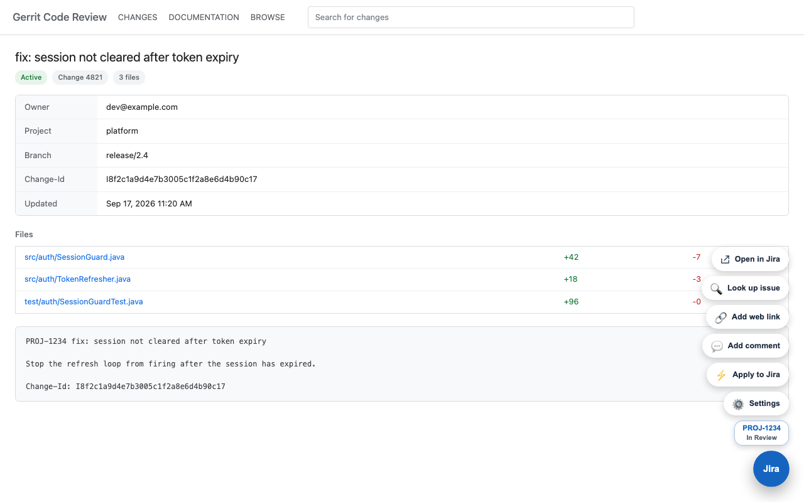
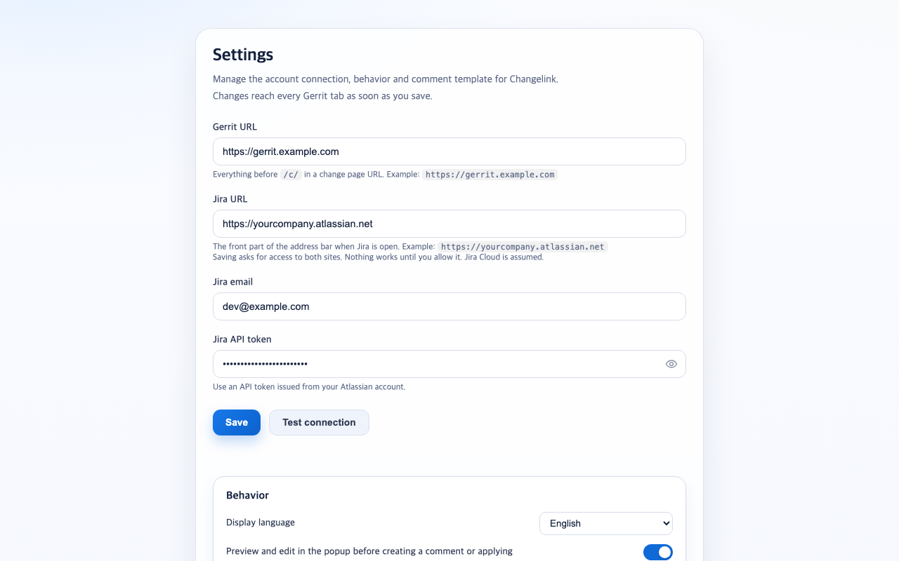

<div align="center">
  
  <h1>Changelink</h1>
  <p><strong>Update Jira from the Gerrit change you are already looking at.</strong></p>
  <p>
    
    
    
    
  </p>
  <p><strong>English</strong> · <a href="README.ko.md">한국어</a></p>
</div>

<p align="center">
  
</p>

Reviewing a change on Gerrit and then switching to Jira to paste the link, write the
comment and move the status is three tabs and five minutes of nothing. Changelink does
that from the change page.

It reads the issue key out of the commit message, then talks to the Jira REST API
directly from the extension. There is no server in between, and no account to sign up for.

## What it does

- Finds the Jira issue key in the change subject or commit message, and shows the issue status right on the page
- Adds the Gerrit change as a Jira remote link
- Posts a comment built from your own template, with a preview you can edit before it goes out
- Moves the issue to another status
- Does all of the above in one click, skipping the comment if the same one is already there
- Puts a draggable quick action button on the change page, with the buttons you pick

## Install

**From the Chrome Web Store:** [Changelink for Gerrit and Jira Cloud](https://chromewebstore.google.com/detail/jebbalmncnfhgcfgpkomacgmelhbfdcl) (in review; the link goes live once it passes)

**From source:**

```bash
git clone https://github.com/osntak/changelink-gerrit-jira.git
cd changelink-gerrit-jira
npm run build          # writes changelink-v<version>.zip
```

Then open `chrome://extensions`, turn on Developer mode, and load the unpacked folder.

## Setup

Open the options page (extension icon, then the gear button) and fill in four fields:

| Field | Example |
| --- | --- |
| Gerrit URL | `https://gerrit.example.com` |
| Jira URL | `https://yourcompany.atlassian.net` |
| Jira email | `dev@example.com` |
| Jira API token | [create one here](https://id.atlassian.com/manage-profile/security/api-tokens) |

Saving asks for access to those two sites. That prompt is the extension requesting host
permissions for the URLs you just typed, and it has to be allowed for anything to work.
The connection test checks the credentials against `/rest/api/3/myself` and reports the
HTTP status, so a wrong token says 401 instead of failing silently later.

<p align="center">
  
</p>

## Language

The interface speaks English and Korean. The options page has a language setting with
three choices: follow the browser, English, or Korean. It applies immediately, including
in Gerrit tabs that are already open.

## Comment template

The template is yours to edit on the options page. Available placeholders:

| Placeholder | Value |
| --- | --- |
| `{title}` | change subject |
| `{body}` | commit message body |
| `{branch}` | target branch |
| `{change_num}` | change number |
| `{change_id}` | Change-Id |
| `{project}` | Gerrit project |
| `{owner}` | change owner |
| `{date}` | submit time, blank when the change is not submitted |
| `{url}` | change URL |

`{body}` drops the lines that are noise inside Jira: `jira:`, `Change-Id:` and
`cherry-picked from`.

## Permissions

| Permission | Why |
| --- | --- |
| `storage` | Keeps your URLs, credentials and template in `chrome.storage.local` |
| `scripting` | Registers the content script on your Gerrit host, and re-injects it into open tabs after an extension reload |
| optional host access | Your Gerrit and Jira URLs, requested when you save them |

The manifest asks for no host up front. Which two sites this extension may touch is
decided by what you type into the options page, and nothing else is reachable.

Credentials live in `chrome.storage.local`, never in `sync`, and never leave the browser
except as the `Authorization` header on requests to your own Jira. Tokens are never
logged. See [PRIVACY.md](PRIVACY.md).

## Requirements

- **Jira Cloud.** The extension speaks REST API v3 and posts comments in ADF, so Jira
  Server and Data Center do not work yet.
- **Gerrit** with the standard `/c/<project>/+/<number>` change URLs.

## How it is put together

| File | Role |
| --- | --- |
| `service_worker.js` | Every Jira API call. Nothing else makes network requests |
| `content_script.js` | Reads the change context out of the Gerrit DOM, draws the quick action button and status badge |
| `popup.js` | The toolbar popup |
| `options.js` | Settings, credential test, host permission request |
| `i18n.js` | String table and language resolution shared by all four |

## Releases

Push a `vX.Y.Z` tag and the release workflow syncs the manifest version, builds the zip
and publishes a GitHub release.

```bash
git tag v1.5.2 && git push origin v1.5.2
```

## License

MIT. See [LICENSE](LICENSE).
